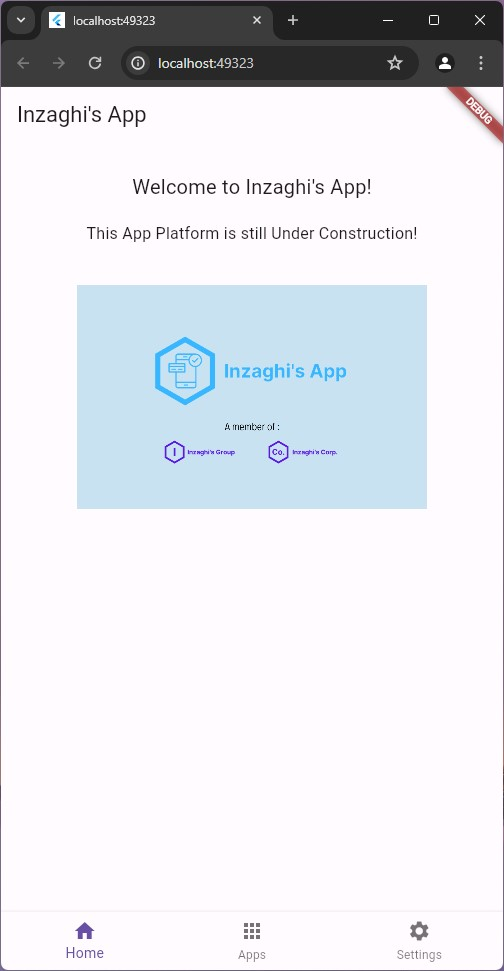
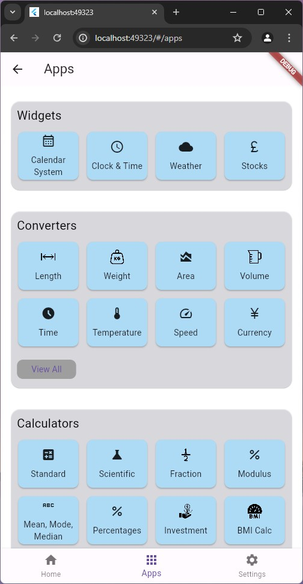
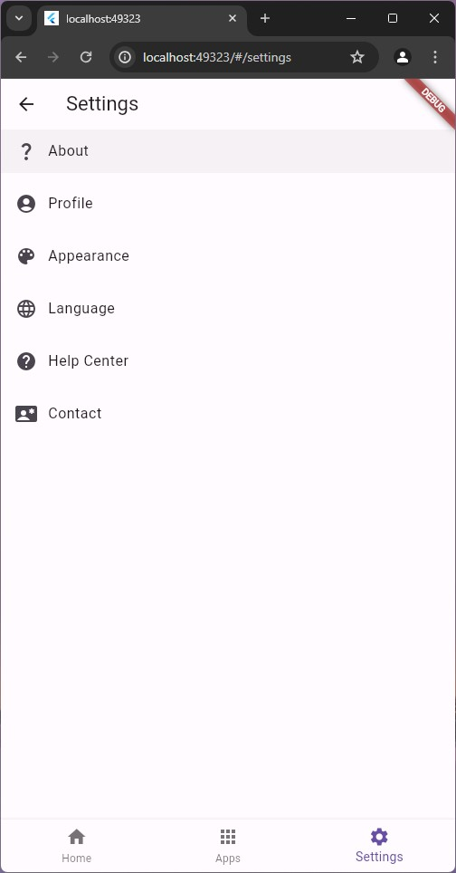

# Inzaghi's App

This Repository is for storing all Source Codes from Inzaghi's App.

Inzaghi’s App merupakan Aplikasi Konten-konten yang menyajikan apapun dengan Tampilan Versi Mobile dari Inzaghi’s Sites, seperti Inzaghi’s Blog, Inzaghi’s Media, dan Inzaghi’s Group. Dulunya, Inzaghi’s App juga berawal dari Inzaghi’s Sites dan kemudian terpisah menjadi Layanan sendiri.

## Description

Inzaghi’s App merupakan Aplikasi Konten-konten yang menyajikan apapun dengan Tampilan Versi Mobile dari Inzaghi’s Sites, seperti Inzaghi’s Blog, Inzaghi’s Media, dan Inzaghi’s Group. Dulunya, Inzaghi’s App juga berawal dari Inzaghi’s Sites dan kemudian terpisah menjadi Layanan sendiri.

Inzaghi’s App kemungkinan akan diluncurkan pada Tahun 2024 mendatang, dan mungkin saja Paling Lambat selesai pada Tahun 2025 mendatang. Dan kemungkinan saja, Inzaghi’s Apps akan dikembangkan dengan menggunakan Flutter dan berbahasa Dart.

## Inzaghi's App Homepage

Berikut ini adalah Tampilan Utama dari Inzaghi's App :

1. Home Page

2. App Page

3. Settings Page

